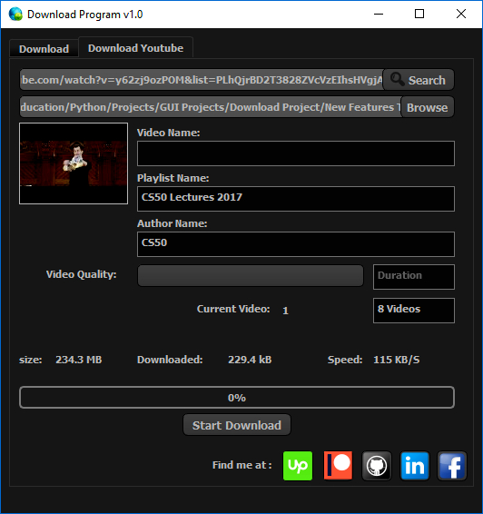

# pyqt5downloader
my 1st project in pyqt5 with python still in progress 

any comments please don't hesitate :)

there are 3 sections : regular download , youtube video , youtube playlist

-Regular Download :

-Youtube Video :

-Playlist :

as i mentioned this project still in progress 

